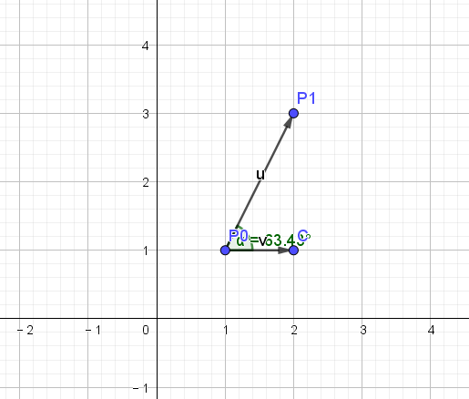
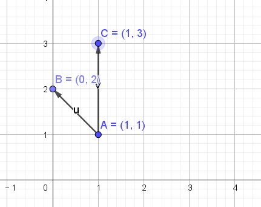
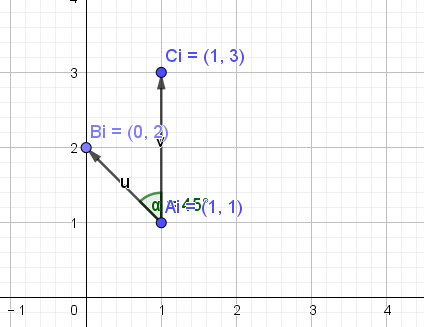

## org.locationtech.jts.algorithm.Angle 角度计算使用说明

###  Angle
角度计算
#### 1.Angle.angle(p0,p1)
```
public static double angle(Coordinate p0, Coordinate p1) {
  double dx = p1.x - p0.x;
  double dy = p1.y - p0.y;
  return Math.atan2(dy, dx);
}
```
返回与x轴正方向的夹角：计算p0到p1的弧度 Angle.angle(p0,p1)已x轴为参考向量，通过p0到p1向量的角度值(返回弧度)。<br/>

**atan2(y,x)说明:**
atan2(y,x) 其中y代表已知点的y坐标，同理x，返回值是此点与远点连线与x轴正方向的夹角，返回以弧度表示的y/x 的反正切。y和x的值的符号决定了正确的象限。也可以理解为计算复数x+yi的辐角，计算时atan2比atan 稳定。可以处理四个象限的任意情况，它的值域相应的也就是(-π,π)<br/>

atan2(y,x)是四象限反正切，它的取值不仅取决于正切值y/x ，还取决于点(x,y) 落入哪个象限：<br/>
当点(x,y) 落入第一象限时，atan2(y,x) 的范围是(0,π/2);<br/>
当点(x,y) 落入第二象限时，atan2(y,x) 的范围是(π/2,π);<br/>
当点(x,y) 落入第三象限时，atan2(y,x) 的范围是(-π,－π/2);<br/>
当点(x,y) 落入第四象限时，atan2(y,x) 的范围是(-π/2,0)<br/>
```
public static void main(String[] args) {

    //计算p0到p1的弧度 Angle.angle(p0,p1)已x轴为参考向量，通过p0到p1向量的角度值(返回弧度)
    Coordinate p0 = new Coordinate(1,1);
    Coordinate p1 = new Coordinate(2,3);

    double radiansP0ToP1 = Angle.angle(p0,p1);
    System.out.println("弧度Angle.angle(p0,p1)="+radiansP0ToP1+";角度Angle.toDegrees(radiansP0ToP1)="+Angle.toDegrees(radiansP0ToP1));

   //弧度Angle.angle(p0,p1)=1.1071487177940904;角度Angle.toDegrees(radiansP0ToP1)=:63.43494882292201
}
```

<br>

#### 2.Angle.angle(p1)
返回与x轴正方向的夹角：计算(0,0)到p1的弧度 Angle.angle(p1)已x轴为参考向量，通过(0,0)到p1向量的角度值(返回弧度)。

#### 3.Angle.isAcute(Coordinate p0, Coordinate p1, Coordinate p2)
判断是否是锐角
```
Coordinate B = new Coordinate(0,2);
Coordinate A = new Coordinate(1,1);
Coordinate C = new Coordinate(1,3);

System.out.println("是否是锐角:boolean="+Angle.isAcute(B,A,C));
//是否是锐角:boolean=true
```
(图二)<br>
#### 4.Angle.isObtuse(Coordinate p0, Coordinate p1, Coordinate p2)
判断是否是钝角，使用规则同Angle.isAcute
#### 5.Angle.angleBetween(Coordinate tip1, Coordinate tail,Coordinate tip2)
返回两个向量之间无方向的最小夹角(参考图二) [0, Pi)
```
double bac = Angle.angleBetween(B,A,C);
System.out.println("bac夹角Angle.angleBetween(B,A,C)="+bac+";角度Angle.toDegrees(bac)="+Angle.toDegrees(bac));
//bac夹角Angle.angleBetween(B,A,C)=0.7853981633974483;角度Angle.toDegrees(bac)=45.0       
```
#### 6.Angle.angleBetweenOriented(Coordinate tip1, Coordinate tail,Coordinate tip2)
返回两个向量之间方向的最小夹角(参考图二)(-Pi, Pi]<br>
逆时针返回正 BAC, 顺时针返回负<br>
```
//顺时针 (CW) rotation 以AB为起点边,最小角度旋转到AC边
double bacOriented = Angle.angleBetweenOriented(B,A,C);
System.out.println("bacOriented顺时针夹角Angle.angleBetweenOriented(B,A,C)="+bacOriented+";顺时针角度Angle.toDegrees(bacOriented)="+Angle.toDegrees(bacOriented));
//bacOriented顺时针夹角Angle.angleBetweenOriented(B,A,C)=-0.7853981633974483;顺时针角度Angle.toDegrees(bacOriented)=-45.0

//逆时针(CCW) rotation 以AC为起点边,最小角度旋转到AB边
double bacOrientedCCW = Angle.angleBetweenOriented(C,A,B);
System.out.println("bacOrientedCCW逆时针夹角Angle.angleBetweenOriented(C,A,B)="+bacOrientedCCW+";逆时针角度Angle.toDegrees(bacOrientedCCW)="+Angle.toDegrees(bacOrientedCCW));
//bacOrientedCCW逆时针夹角Angle.angleBetweenOriented(C,A,B)=0.7853981633974483;逆时针角度Angle.toDegrees(bacOrientedCCW)=45.0     
```
#### 7.Angle.normalizePositive(double angle)
找对应的逆时针角度,例如 -45°=>315°,转换角度范围，如果是600°转换到 [ 0, 2*Pi )之间的值域
```
//找对应的顺时针角度,例如 -45°=>315°
System.out.println(Angle.toDegrees(Angle.normalizePositive(bacOriented)));
//315.0
```
#### 8.Angle.normalize(double angle)
找对应的顺时、逆时针位置,0到180(逆时针)之间返回正数，180-360(顺时针)之前返回负数，转换后的值域范围 (-Pi, Pi]
```
//找对应的位置 0到180(逆时针)之间返回正数，180-360(顺时针)之前返回负数
System.out.println(Angle.toDegrees(Angle.normalize(Angle.toRadians(50))));
//50.0
System.out.println(Angle.toDegrees(Angle.normalize(Angle.toRadians(181))));
//-179.0
System.out.println(Angle.toDegrees(Angle.normalize(Angle.toRadians(369))));
//9.0
System.out.println(Angle.toDegrees(Angle.normalize(Angle.toRadians(-10))));
//-10.0
```
#### 9.Angle.diff(double ang1, double ang2)
计算角度的差值 ang1 (in [-Pi, Pi] );ang2 (in range [-Pi, Pi] ) return:in range [0, Pi]
```
 //差值计算
double ang01 = Angle.normalize(Angle.toRadians(10));
double ang02 = Angle.normalize(Angle.toRadians(369)); //0.9999999999999999
// double ang02 = Angle.normalize(Angle.toRadians(-10)); //20
System.out.println(Angle.toDegrees(Angle.diff(ang01,ang02)));
```
#### 10.Angle.interiorAngle(Coordinate p0, Coordinate p1, Coordinate p2)
计算内角,值域[0, 2Pi]
<br>
```
//10.Angle.interiorAngle(Coordinate p0, Coordinate p1, Coordinate p2) 计算内角(最小角)
Coordinate Bi = new Coordinate(0,2);
Coordinate Ai = new Coordinate(1,1);
Coordinate Ci = new Coordinate(1,3);
//延Ai-Bi边逆时针转到Ai-CI边的角度值
System.out.println("Angle.interiorAngle(Bi,Ai,Ci)角度="+Angle.toDegrees(Angle.interiorAngle(Bi,Ai,Ci)));
//Angle.interiorAngle(Bi,Ai,Ci)角度=315.0

//延Ci-Ai边逆时针转到Ai-BI边的角度值
System.out.println("Angle.interiorAngle(Ci,Ai,Bi)角度="+Angle.toDegrees(Angle.interiorAngle(Ci,Ai,Bi)));
//Angle.interiorAngle(Ci,Ai,Bi)角度=45.0
```
