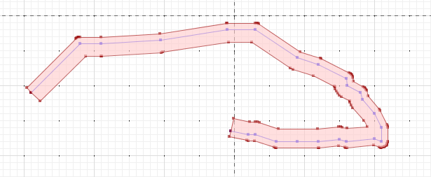

# 案例：扩buffer,左扩N米右扩N米
## 使用场景
将linestring进行扩buffer,左扩1米右扩2米
## 示例图例

## 示例代码

```java
package com.leokok.jts.learning.jts.core.algorithm;

import com.leokok.jts.learning.jts.core.demo.DisDegreeTest;
import com.leokok.jts.learning.jts.core.demo.KmDegreeTest;
import org.locationtech.jts.geom.Geometry;
import org.locationtech.jts.io.ParseException;
import org.locationtech.jts.io.WKTReader;
import org.locationtech.jts.operation.buffer.BufferOp;
import org.locationtech.jts.operation.buffer.BufferParameters;

/**
 * 扩圈测试
 */
public class BufferTest {

    /**
     * 实现功能 延画线方向 左扩N米 又扩N米
     * @param args
     */
    public static void main(String[] args) throws ParseException {

        WKTReader wktReader = new WKTReader();
        Geometry geometry = wktReader.read("LINESTRING (117.28071000000001 38.964890000000004, 117.28078000000002 38.964960000000005, 117.28081000000002 38.964960000000005, 117.280895 38.964965, 117.28099000000002 38.964980000000004, 117.28103000000002 38.964980000000004, 117.28109000000002 38.964940000000006, 117.28112000000002 38.96493, 117.28116000000001 38.96491, 117.28116125 38.9649, 117.28118000000002 38.964890000000004, 117.2811825 38.96488, 117.28120000000001 38.96486000000001, 117.28121000000002 38.96484, 117.28121000000002 38.96482, 117.2812 38.96482375, 117.28116000000001 38.96482, 117.28115 38.9648225, 117.28112000000002 38.96482, 117.28109000000002 38.96482, 117.28106000000001 38.96482, 117.28103000000002 38.964830000000006, 117.28102000000001 38.964830000000006, 117.280995 38.964835)");

        BufferParameters bufferParameters = new BufferParameters();
        bufferParameters.setSingleSided(true);

        BufferOp bufOp = new BufferOp(geometry, bufferParameters);

        //1KM大约等于多少度
        double kmToDegreeLeft = DisDegreeTest.cmToDegree(1 * 100);
        double kmToDegreeRight = DisDegreeTest.cmToDegree(2 * 100);

        Geometry geometryLeft = bufOp.getResultGeometry(kmToDegreeLeft); //左
        Geometry geometryRight = bufOp.getResultGeometry(-kmToDegreeRight); //右 -1

        Geometry bufferGeo = geometryLeft.union(geometryRight);

        System.out.println(bufferGeo.toText());


    }
}

```