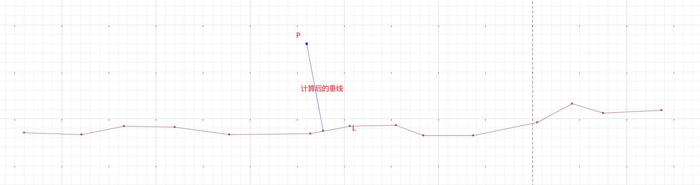

# 案例：计算点到线的垂线
## 使用场景
计算点在线上的垂足;点的垂线
# 示例
DistanceToPoint.computeDistance
## 示例图例
计算P点到L的垂线<br>

## 示例代码
```java
package com.leokok.jts.learning.jts.core.demo;

import org.locationtech.jts.algorithm.distance.DistanceToPoint;
import org.locationtech.jts.algorithm.distance.PointPairDistance;
import org.locationtech.jts.geom.LineString;
import org.locationtech.jts.geom.Point;
import org.locationtech.jts.io.ParseException;
import org.locationtech.jts.io.WKTReader;

/**
 * 计算点在线的垂线
 * 计算点在线上的垂足
 */
public class FootPointTest {

    public static void main(String[] args) throws ParseException {
        PointPairDistance pointPairDistance = new PointPairDistance();

        WKTReader wktReader = new WKTReader();
        //线L1
        LineString lineString =  (LineString) wktReader.read("LINESTRING (115.805946 39.2572185, 115.8059521 39.2572183, 115.8059566 39.2572192, 115.805962 39.2572191, 115.8059678 39.2572183, 115.8059764 39.2572184, 115.8059806 39.2572192, 115.8059855 39.2572193, 115.8059884 39.2572182, 115.8059937 39.2572182, 115.8060005 39.2572196, 115.8060042 39.2572216, 115.8060075 39.2572206, 115.8060137 39.2572209)");
        //点p1
        Point point = (Point) wktReader.read("POINT (115.805976 39.257228)");
        DistanceToPoint.computeDistance(lineString, point.getCoordinate(),pointPairDistance);

        System.out.println(pointPairDistance.toString());
        //LINESTRING ( 115.80597777855581 39.257218662582055, 115.805976 39.257228 )

    }
}
```