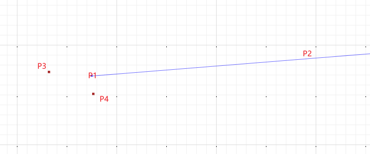

# 案例：延线的画线方向，判断点在线的右侧还是左侧
思路：通过向量角度的正负来进行判断
# 示例
## Angle.angleBetweenOriented
## 示例图例
判断P3,P4在线段 P1-P2的左侧还是右侧<br>

## 示例代码
```java
package com.leokok.jts.learning.jts.core.demo;

import org.locationtech.jts.algorithm.Angle;
import org.locationtech.jts.geom.Coordinate;

/**
 * 左右判断
 * 通过向量的角度来判断点在线的左侧还是右侧
 */
public class LeftRightTest {

    public static void main(String[] args) {

        //p1线的起点 p2向量的终点  p3外部在判断位置的点
        double angleLeft = Angle.angleBetweenOriented(new Coordinate(121.5269675, 30.91322688), new Coordinate(121.52718887, 30.91324457), new Coordinate(121.5269632, 30.9132273));
        //p1线的起点 p2向量的终点  p4外部在判断位置的点
        double angleRight = Angle.angleBetweenOriented(new Coordinate(121.5269675, 30.91322688), new Coordinate(121.52718887, 30.91324457), new Coordinate(121.52696764327527 ,30.91322508707482));
        System.out.println("left:"+Angle.toDegrees(angleLeft));
        System.out.println("right:"+Angle.toDegrees(angleRight));

        //结论:通过此方式  ＜0在左侧，＞0在右侧
        //left:-0.19269756979628577
        //right:0.46404119632189633
    }
}
```
# 结论
＜0在左侧，＞0在右侧