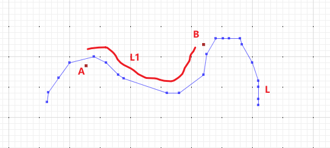
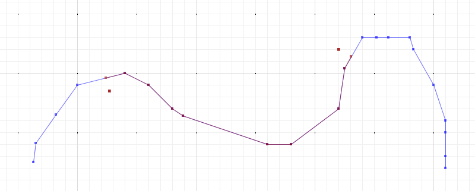

# 案例：根据起始点求一个线的子线
# 示例
求A,B点之间在L上面的线段L1<br>

## 说明
通过LocationIndexedLine来实现;<br>
借助**locationIndexedLine.indexOf**<br>
A上面的第一个形状点p1,投影到l上面得到p11;<br>
B上面生的最后一个形状点Pn,投影到l上面得到Pnn;<br>
通过locationIndexedLine.extractLine(p2位置,Pn位置) 来截取生成投影对象 L1
## 示例代码
```java
package com.leokok.jts.learning.jts.core.demo;

import org.locationtech.jts.geom.Coordinate;
import org.locationtech.jts.geom.Geometry;
import org.locationtech.jts.io.ParseException;
import org.locationtech.jts.io.WKTReader;
import org.locationtech.jts.linearref.LinearLocation;
import org.locationtech.jts.linearref.LocationIndexedLine;

/**
 * 根据起始点求一个线的子线
 */
public class SubLineByPointTest {

    public static void main(String[] args) throws ParseException {


        WKTReader reader = new WKTReader();
        Geometry l = reader.read("LINESTRING (263 225, 265 241, 282 265, 300 290, 340 300, 360 290, 380 270, 389 264, 460 240, 480 240, 520 270, 525 304, 540 330, 552 330, 562 330, 580 330, 583 320, 600 290, 610 260, 610 250, 610 230, 610 220)");
        LocationIndexedLine lil = new LocationIndexedLine(l);
        LinearLocation start = lil.indexOf(new Coordinate(327, 285));
        LinearLocation end = lil.indexOf(new Coordinate(520, 320));
        Geometry l1 = lil.extractLine(start, end);
        System.out.println(l1.toText());

        // 结果
        //LINESTRING (324.2352941176471 296.05882352941177, 340 300, 360 290, 380 270, 389 264, 460 240, 480 240, 520 270, 525 304, 530.677025527192 313.84017758046616)


    }
}

```
## 效果
