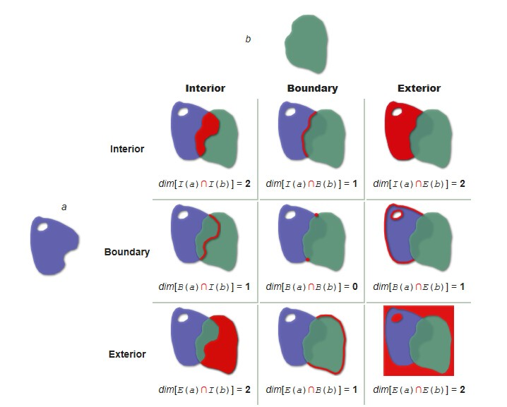

## org.locationtech.jts.geom.IntersectionMatrix 使用说明

###  IntersectionMatrix DE-9IM模型操作类
#### 说明
DE-9IM 是一种拓扑模型，用于描述两个几何图形空间关系的一种标准。在专业领域，通常将每个几何图形分为三部分：外部（exterior),边界（boundary)和内部(interior)。 
 两个图形的关系判断，实际上就是三个部分的分别判断，因此就会有一个3*3交叉矩阵，这个矩阵就是DE-9IM模型： 
 
I()代表内部，B()代表边界，E()外部。在结果中，相交为点的维度为0，相交为线的维度为1，相交为面维度为2，-1代表没有相交即没有维度。如上图红色为相交图形，下面为对应相交维度结果。 相对应的如果相交维度为0、1、2值的时候我们可以用T代表，不相交-1用F代表，所以其结果可以生成一个字符串来表示2个图形关系（谓词）。如上图则"212101212"变为"TTTTTTTTT"。 
[具体细节参看DE-9IM wiki](https://en.wikipedia.org/wiki/DE-9IM)
#### 操作示例