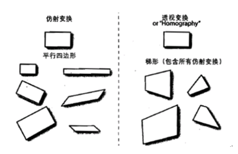
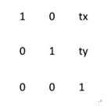
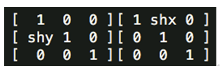
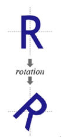

## 仿射变换理论基础
### 变化模型分类
变换模型是指根据待匹配图像与背景图像之间几何畸变的情况，所选择的能最佳拟合两幅图像之间变化的几何变换模型。可采用的变换模型有如下几种:刚性变换、仿射变换、透视变换和非线形变换等，如下图 
 
其中第三个的仿射变换就是我们这节要讨论的。
仿射变换(Affine Transformation)
Affine Transformation是一种二维坐标到二维坐标之间的线性变换，保持二维图形的“平直性”（译注：straightness，即变换后直线还是直线不会打弯，圆弧还是圆弧）和“平行性”（译注：parallelness，其实是指保二维图形间的相对位置关系不变，平行线还是平行线，相交直线的交角不变） 
 
**c和d的区别可以看下图**
 
### 仿射变换(Affine Transformation)
仿射变换可以通过一系列的原子变换的复合来实现，包括：平移（Translation）、缩放（Scale）、反射（reflection）、旋转（Rotation）和剪切（Shear） 
 
### 仿射变换(Affine Transformation)公式
 
### 变化样例
#### 平移变换 Translation
将每一点移动到(x+tx, y+ty)，变换矩阵为
 
平移变换是一种“刚体变换”，rigid-body transformation，就是不会产生形变的理想物体。
效果：
 
#### 缩放变换（Scale）
将每一点的横坐标放大（缩小）至sx倍，纵坐标放大（缩小）至sy倍，变换矩阵为：
 
变换效果如下：
 
#### 剪切变换（Shear）
变换矩阵为：
 
相当于一个横向剪切与一个纵向剪切的复合
 
效果：
 

#### 旋转变换（Rotation）
目标图形围绕原点顺时针旋转theta弧度，变换矩阵为：
 
效果：
 

### 一些常用变化样例
 