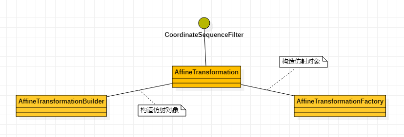

## org.locationtech.jts.geom.util.AffineTransformation 使用说明

### AffineTransformation 仿射变换工具类
#### AffineTransformation 相关类关系图

#### 说明
表示二维笛卡尔平面上的仿射变换。它可用于变换坐标或几何。<br>
仿射变换是通过以下基本类型的一系列变换将2D平面映射到其自身：<br>
reflection反射（通过直线）<br>
rotation旋转（绕原点）<br>
scaling缩放（相对于原点）<br>
shearing剪切（在X和Y方向）<br>
translation（平移）
#### 操作示例
#### 坐标系平移示例一
定义坐标原点从C1(0,0)移动到C2(3,3)见图<br>
<br>
**代码示例**
```java
//通过 factory创建 AffineTransformation
// 参考坐标C1(0,0)作为坐标零点; 移动到参考坐标(3,3)作为坐标原点记作参考系C2
AffineTransformation affineTransformation = AffineTransformationFactory.createFromControlVectors(new Coordinate(0.0,0.0), new Coordinate(3.0,3.0));
```
#### point平移
将坐标点A(1,1)从坐标系C1,转换到坐标系C2,转换后的坐标A'(4,4)<br>
**代码示例**
```java
GeometryFactory geometryFactory = new GeometryFactory();
//1. 平移
//1.1 将A point(1,1) 移动到新坐标系上面
Point pointA = geometryFactory.createPoint(new Coordinate(1.0,1.0));
System.out.printf("坐标A,WKT:%s \r\n",pointA.toText());
Geometry geometryA = affineTransformation.transform(pointA);
System.out.printf("坐标A移动后的A',WKT:%s \r\n", geometryA.toText());
```
**结果输出**
```text
坐标A,WKT:POINT (1 1) 
坐标A移动后的A',WKT:POINT (4 4) 
```
**效果图**

<br>
#### lineString平移
**代码示例**
```java
//1.2 平移线 (0,1) (1,2)
Coordinate[] coordinates = new Coordinate[2];
coordinates[0] = new Coordinate(0,1);
coordinates[1] = new Coordinate(1,2);
LineString lineStringA = geometryFactory.createLineString(coordinates);
System.out.printf("线A,WKT:%s \r\n",lineStringA.toText());
Geometry lineStringATrans = affineTransformation.transform(lineStringA);
System.out.printf("线A移动后的线A',WKT:%s \r\n", lineStringATrans.toText());

```
**结果输出**
```text
线A,WKT:LINESTRING (0 1, 1 2) 
线A移动后的线A',WKT:LINESTRING (3 4, 4 5) 
```
**效果图**

<br>

#### POLYGON平移
**代码示例**
```java
//1.3 平移 pologn
Coordinate[] coordinates3 = new Coordinate[4];
coordinates3[0] = new Coordinate(0,1);
coordinates3[1] = new Coordinate(1,2);
coordinates3[2] = new Coordinate(1,3);
coordinates3[3] = new Coordinate(0,1);
Polygon polygonA = geometryFactory.createPolygon(coordinates3);
System.out.printf("框A,WKT:%s \r\n",polygonA.toText());
Geometry polygonATrans = affineTransformation.transform(polygonA);
System.out.printf("框A移动后的框A',WKT:%s \r\n", polygonATrans.toText());
```
**结果输出**
```text
框A,WKT:POLYGON ((0 1, 1 2, 1 3, 0 1)) 
框A移动后的框A',WKT:POLYGON ((3 4, 4 5, 4 6, 3 4)) 
```
**效果图**

<br>

#### 坐标系平移示例二
根据参考线到线平移几何

**代码示例**
```java
 //定义线参考
AffineTransformation affineTransformationBaseLine = AffineTransformationFactory.createFromBaseLines(new Coordinate(0.0,1.0), new Coordinate(3.0,4.0),new Coordinate(6,0),new Coordinate(5,3));

CoordinateList coordinateList = new CoordinateList();
coordinateList.add(new Coordinate(2,2));
coordinateList.add(new Coordinate(2,1));
coordinateList.add(new Coordinate(3,1));
coordinateList.add(new Coordinate(3,2));
coordinateList.add(new Coordinate(2,2));

Polygon polygon = geometryFactory.createPolygon(coordinateList.toCoordinateArray());
System.out.printf("框A,WKT:%s \r\n",polygon.toText());
Geometry polygonTrans = affineTransformationBaseLine.transform(polygon);
System.out.printf("框A移动后的框A',WKT:%s \r\n", polygonTrans.toText());
```
**结果输出**
```text
框A,WKT:POLYGON ((2 2, 2 1, 3 1, 3 2, 2 2)) 
框A移动后的框A',WKT:POLYGON ((6 1.6666666666666672, 6.666666666666667 1.3333333333333337, 7 2.0000000000000004, 6.333333333333333 2.3333333333333335, 6 1.6666666666666672)) 
```
**效果图**

<br>