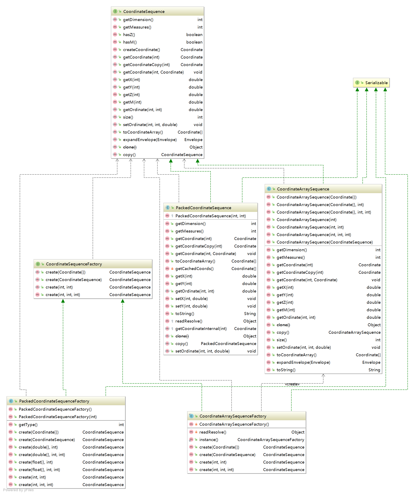

## org.locationtech.jts.geom.impl 使用说明

### prep包
#### 类关系图

#### 说明
Coordinate操作几何工厂类,CoordinateArraySequenceFactory单例模式
#### 提供的方法

#### 操作示例
```java
package com.leokok.jts.learning.jts.core.geom.impl;

import org.locationtech.jts.geom.Coordinate;
import org.locationtech.jts.geom.CoordinateArrays;
import org.locationtech.jts.geom.CoordinateSequence;
import org.locationtech.jts.geom.impl.CoordinateArraySequence;
import org.locationtech.jts.geom.impl.CoordinateArraySequenceFactory;
import java.util.ArrayList;
import java.util.List;

/**
 * CoordinateArraySequenceFactory
 */
public class CoordinateArraySequenceImplTest {

    public static void main(String[] args) {

        List<Coordinate> coordinateList = new ArrayList<>();
        coordinateList.add(new Coordinate(0.0,1.1));
        coordinateList.add(new Coordinate(1.1,2.2));
        coordinateList.add(new Coordinate(2.2,3.3));
        coordinateList.add(new Coordinate(3.3,4.4));
        coordinateList.add(new Coordinate(4.4,5.5));
        CoordinateSequence coordinateSequence = CoordinateArraySequenceFactory.instance().create(CoordinateArrays.toCoordinateArray(coordinateList));

        CoordinateArraySequence coordinateArraySequence = new CoordinateArraySequence(CoordinateArrays.toCoordinateArray(coordinateList));

    }
}

```