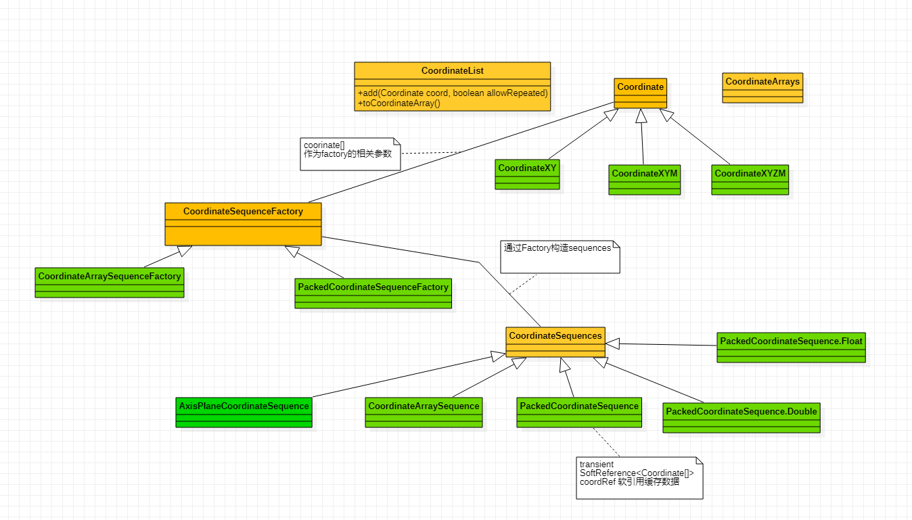

## org.locationtech.jts.geom.Coordinate 使用说明

### Coordinate 经纬度操作类
#### Coordinate 相关类关系图

#### 说明
用于存储二维笛卡尔(2-dimensional Cartesian plane)坐标的轻量级类：<br>
1.提供基础存储X,Y,Z的set get方法<br> 2.提供计算坐标与坐标点的相关计算方法distance,compare,equals等
#### 直接子类
CoordinateXY, CoordinateXYM二维带M, CoordinateXYZM三维度代M; M代表附件属性M值
#### 操作示例
```java
import org.locationtech.jts.geom.Coordinate;

/**
 * 经纬度实体类操作示例
 */
public class CoordinateTest {

    public static void main(String[] args) {

        //1. 通过构造函数赋值 x经度 y纬度
        Coordinate coordinateXY = new Coordinate(0.0,1.1);
        System.out.printf("经纬度为x=%s,y=%s \r\n",coordinateXY.getX(), coordinateXY.getY());

        //2. 通过构造函数赋值 x经度 y纬度 z高度
        Coordinate coordinateXYZ = new Coordinate(0.0,1.1,16.0);
        System.out.printf("经纬度为x=%s,y=%s,z=%s \r\n",coordinateXY.getX(), coordinateXY.getY(), coordinateXYZ.getZ());

        //3. 通过set参数赋值
        Coordinate coordinateXYSetP = new Coordinate();
        coordinateXYSetP.setX(0.1);
        coordinateXYSetP.setY(1.1);
        System.out.printf("经纬度为x=%s,y=%s \r\n",coordinateXYSetP.getX(), coordinateXYSetP.getY());

        //4.子类示例
        CoordinateXYZM coordinateXYZM = new CoordinateXYZM();
        coordinateXYZM.setX(0.0);
        coordinateXYZM.setY(1.1);
        coordinateXYZM.setZ(10);
        coordinateXYZM.setM(2);
        System.out.printf("经纬度为x=%s,y=%s,z=%s,m=%s \r\n",coordinateXYZM.getX(), coordinateXYZM.getY(), coordinateXYZM.getZ(), coordinateXYZM.getM());

    }
}
```