## org.locationtech.jts.geom.Geometry 使用说明

### Geometry 经纬度操作类
#### Geometry类继承关系
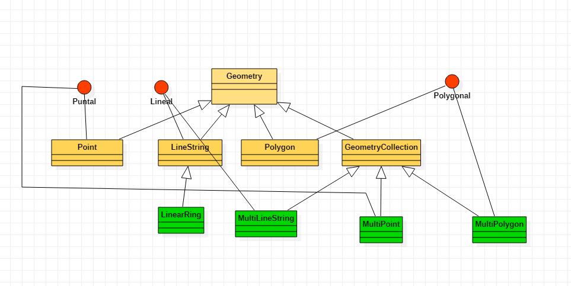
#### 说明
平面、线性几何操作抽象类<br>
提供的相关方法:<br>
**1.基础方法**：<br>
  1.1 getLength:获取长度，线几何返回点与点之间的长度之和；闭合几何返回周长；其它返回0 <br>
  1.2 getSRID：获取srid <br>
  1.3 isEmpty:判读几何是否是空，判断几何的 point.size == 0 ; 或者几何包含 empty: reader.read("POINT EMPTY")<br>
  1.4 isRectangle:判断几何是否是Polygon<br>
  1.5 isValid:判断几何是否符合OGC SFS规格(OGC SFS specification)，例如：Polygon是否自相交等<br>
  1.6 getCentroid: 获取中心点<br>
  1.7 getCoordinates:获取coordinate数据<br>
  1.8 getEnvelope:获取边界<br>
  1.9 toText:返回WKT格式数据<br>
**2.查询比较方法:**<br>
  2.1 equals(Geometry g): 判断两个几何是否相等，不用于GeometryCollection，图引用来自sfs标准<br>
  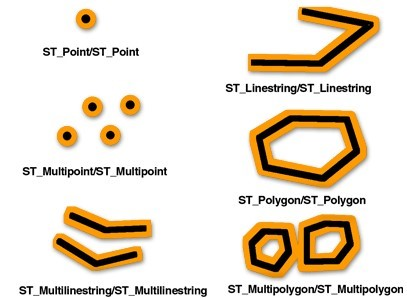<br>
  2.2 disjoint(Geometry g): 判断几何是否是不相交(脱节)的<br>
  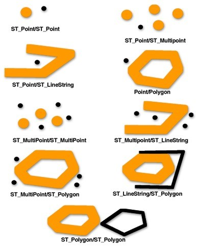<br>
  2.3 intersects(Geometry g): 判断几何是否相交：<br>
  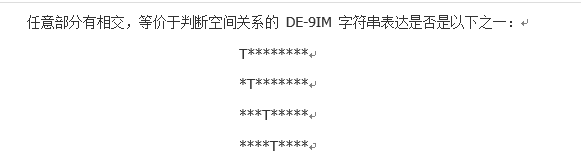<br>
  2.4 touches(Geometry g): 判断几何是否接触：<br>
  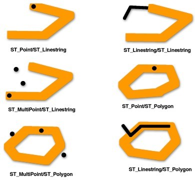<br>
  2.5 crosses(Geometry g): 判断几何是否交叉：<br>
  <br>
  2.6 within(Geometry g): 判断当前几何是否在指定的几何内部：<br>
  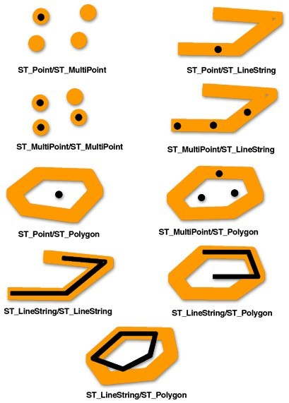<br>
  2.7 contains(Geometry g): 判断当前几何包含g几何：<br>
  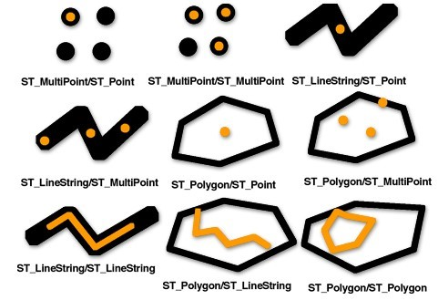<br>
  2.8 overlaps(Geometry g): 判断当前几何与参数g几何是否部分重叠：<br>
  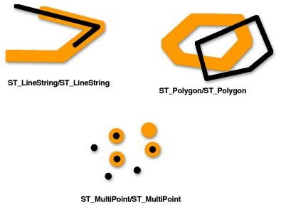<br>
  2.9 relate(Geometry g, String intersectionPattern): 判断当前几何与参数几何是否符合输入的 DE-9IM(例如:intersectionPattern=0*01T12F2)<br>
  2.10 covers(Geometry g): 判断当前几何是否覆盖参数g几何：例如黄色的几何覆盖内层几何<br>
  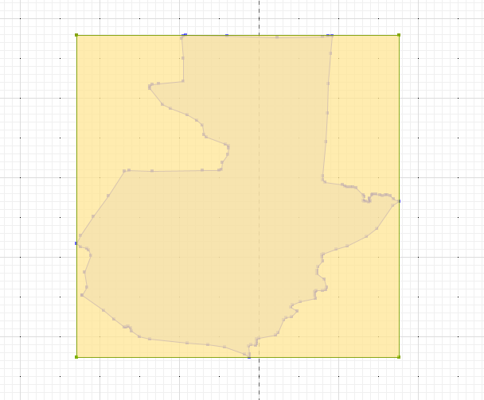<br>
  2.11 coveredBy(Geometry g): 判断当前几何是否被参数g几何掩盖：例如内层几何被外层黄色几何掩盖<br>
  <br>
**3.计算方法:**<br>  
  3.1 intersection(Geometry other): 返回当前几何与输入几何相交的几何数据<br>
  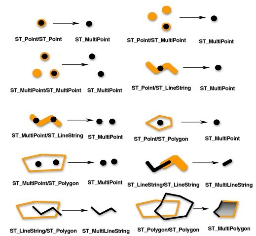<br>
  3.2 difference(Geometry other): 计算差异几何,差异分析,返回other与当前几何不同的几何数据<br>
  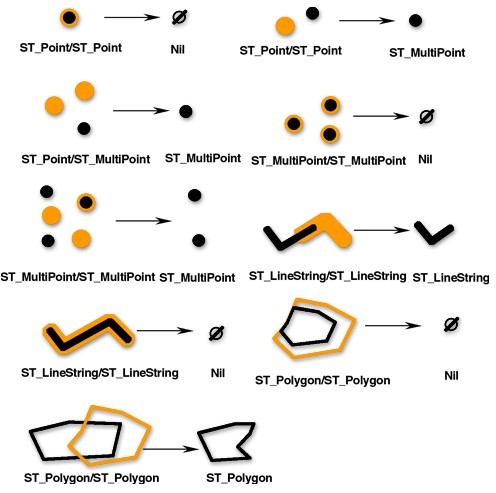<br>
  3.3 union(Geometry other): 合并几何<br>
  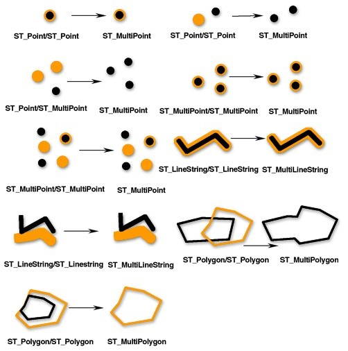<br>
  3.4 symDifference(Geometry other): 对称差异分析,排除一样(重叠)的几何，将当前与other不一样的几何合集返回<br>
  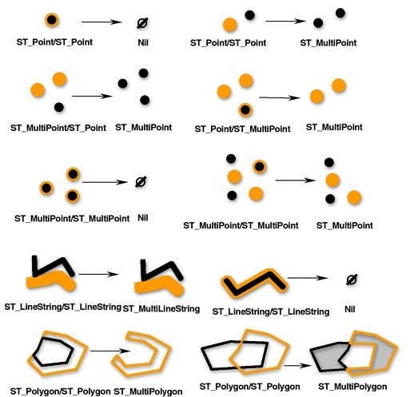<br>
  3.5 buffer(double distance): 加buffer<br>
  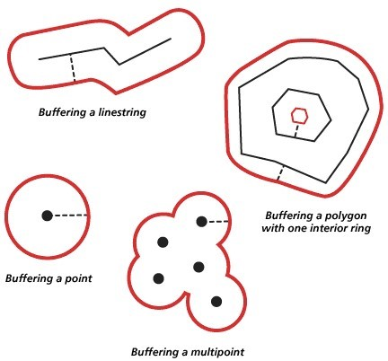<br>
  3.6 buffer(double distance, int quadrantSegments): 加buffer,边界样式<br>
  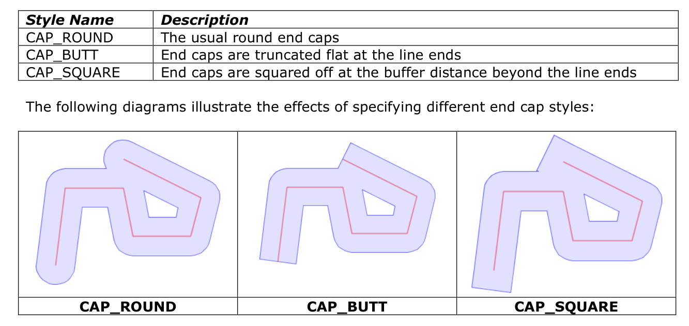<br>
  3.7 convexHull(): 凸包分析,返回当前的几何的覆盖面<br>
  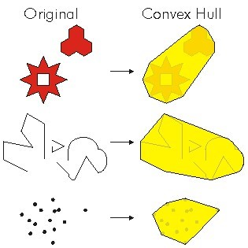<br>
  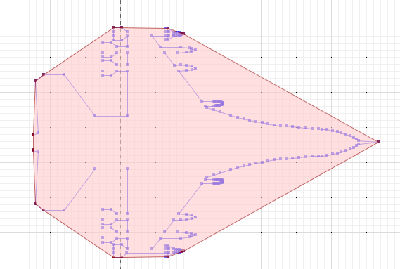<br>
#### 直接子类
GeometryCollection, LineString, Point, Polygon
#### 操作示例
```java
import org.locationtech.jts.geom.Geometry;
import org.locationtech.jts.geom.GeometryFactory;
import org.locationtech.jts.geom.PrecisionModel;
import org.locationtech.jts.geom.impl.PackedCoordinateSequenceFactory;
import org.locationtech.jts.io.ParseException;
import org.locationtech.jts.io.WKTReader;
import java.io.*;

public class GeometryTest {

    public static void main(String[] args) throws FileNotFoundException, ParseException {

        PrecisionModel precisionModel = new PrecisionModel();
        GeometryFactory geometryFactory = new GeometryFactory(precisionModel, 0 ,PackedCoordinateSequenceFactory.DOUBLE_FACTORY);

        //通过geometryFactory 或者 Geometry子类创建 Geometry 实例
        //通过wktReader读取飞机形状wkt数据 （见图一）
        WKTReader wktReader = new WKTReader(geometryFactory);
        InputStream is = GeometryTest.class.getResourceAsStream("/wkt/plane.wkt");
        Geometry geometry = wktReader.read(new InputStreamReader(is));
        System.out.printf("WKT几何形状%s \r\n",geometry.toText());

        //Geometry常用方法示例 （见图一） 红色框代表边界
        Geometry envelopeGeo =  geometry.getEnvelope();
        System.out.printf("WKT边界 geometry.getEnvelope %s", envelopeGeo.toText());
    }
}
```
#### 操作示例截图(图一)
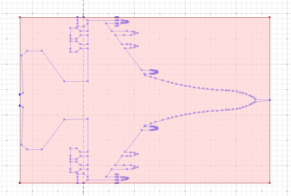

