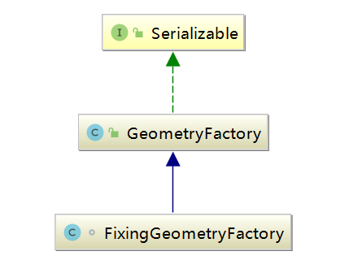
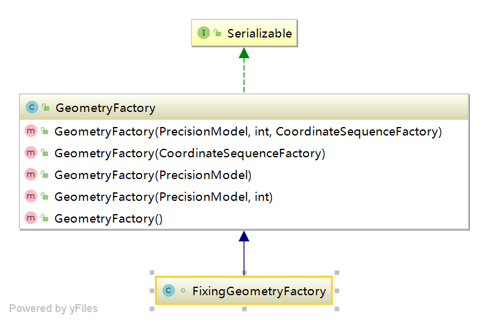
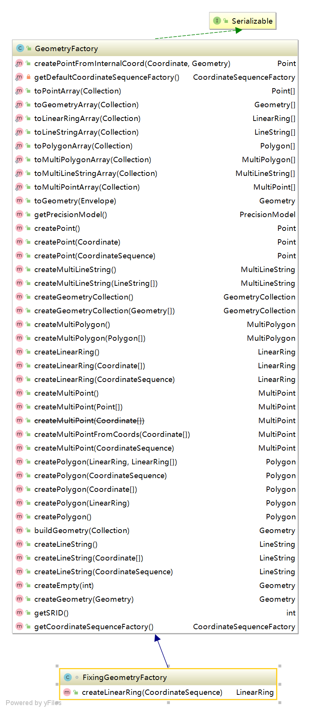

## org.locationtech.jts.geom.GeometryFactory 使用说明

### GeometryFactory 几何操作工厂类
#### 类关系图

#### 说明
提供一组实用方法，用于从坐标列表中构建几何体对象。
请注意，工厂构造方法不会以任何方式更改输入坐标。
#### 直接子类
FixingGeometryFactory:几何工厂扩展，用于修复用于创建线性环的结构错误坐标序列
#### 提供的方法
##### 构造函数

##### 操作方法

#### 操作示例
```java
package com.leokok.jts.learning.jts.core.geom;

import org.locationtech.jts.geom.Coordinate;
import org.locationtech.jts.geom.GeometryFactory;
import org.locationtech.jts.geom.Point;
import org.locationtech.jts.geom.PrecisionModel;

public class GeometryFactoryTest {

    public static void main(String[] args) {
        PrecisionModel precisionModel = new PrecisionModel(PrecisionModel.FLOATING); //double类型

        GeometryFactory geometryFactory = new GeometryFactory(precisionModel, 4326); //84坐标

        //创建等相关操作方法
        Point point = geometryFactory.createPoint(new Coordinate(0.0,1.1));

    }
}

```