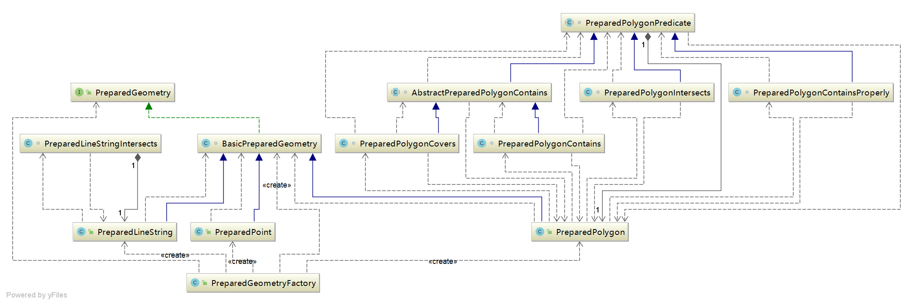
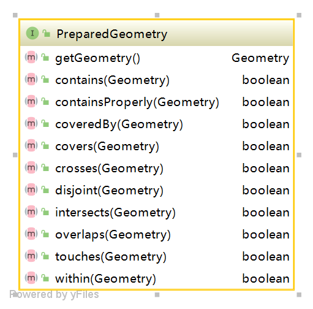

## org.locationtech.jts.geom.prep 使用说明

### prep包
#### 类关系图

#### 说明
适当准备的几何图形执行优化的几何操作类
#### 提供的方法

#### 操作示例
```java
package com.leokok.jts.learning.jts.core.geom.prep;

import org.locationtech.jts.geom.*;
import org.locationtech.jts.geom.impl.CoordinateArraySequenceFactory;
import org.locationtech.jts.geom.impl.PackedCoordinateSequenceFactory;
import org.locationtech.jts.geom.prep.PreparedGeometryFactory;
import org.locationtech.jts.geom.prep.PreparedLineString;
import java.util.ArrayList;
import java.util.List;

public class PreparedTest {

    public static void main(String[] args) {

        PrecisionModel precisionModel = new PrecisionModel();
        GeometryFactory geometryFactory = new GeometryFactory(precisionModel, 0 , PackedCoordinateSequenceFactory.DOUBLE_FACTORY);

        List<Coordinate> coordinateList = new ArrayList<>();
        coordinateList.add(new Coordinate(0.0,1.1));
        coordinateList.add(new Coordinate(1.1,2.2));
        coordinateList.add(new Coordinate(2.2,3.3));
        coordinateList.add(new Coordinate(3.3,4.4));
        coordinateList.add(new Coordinate(4.4,5.5));
        CoordinateSequence coordinateSequence = CoordinateArraySequenceFactory.instance().create(CoordinateArrays.toCoordinateArray(coordinateList));

        LineString lineString = geometryFactory.createLineString(coordinateSequence);

        Point point = geometryFactory.createPoint(new Coordinate(0.0,1.1));

        PreparedLineString preparedLineString = (PreparedLineString)PreparedGeometryFactory.prepare(lineString);
        System.out.println(preparedLineString.intersects(point));
    }
}
```