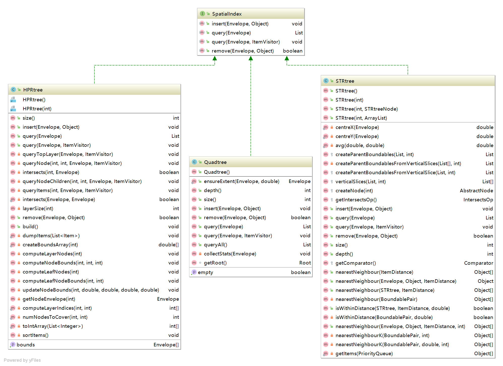
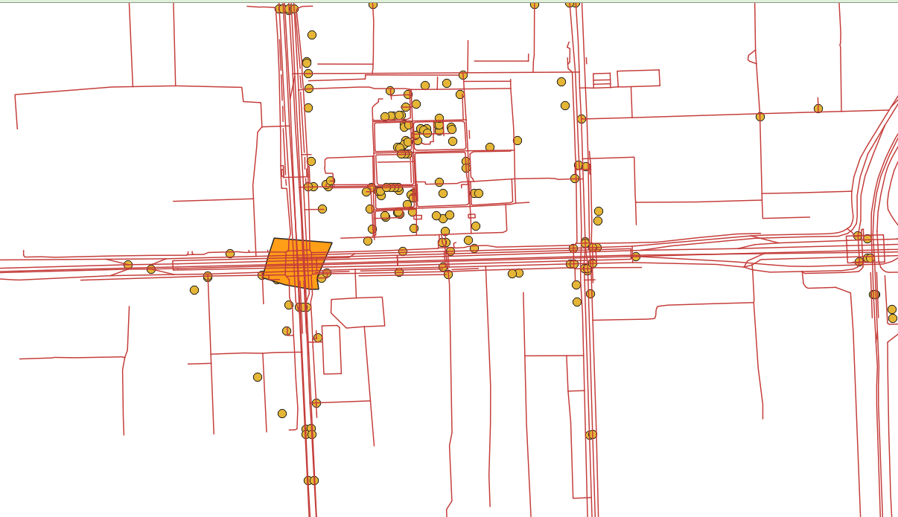
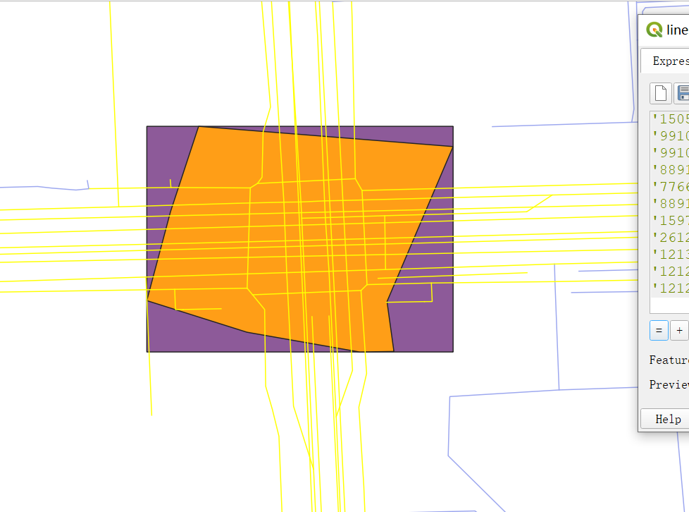

## org.locationtech.jts.index 使用说明

###  SpatialIndex 
#### 说明
空间索引算法使用说明
#### 类关系图
<br>
#### 实现类说明
##### STRtree
<object data="../../statics/index/strtree.pdf" type="application/pdf" width="700px" height="700px">
<embed src="../../statics/index/strtree.pdf">
 文档下载<a href="../../statics/index/strtree.pdf">Download PDF</a>.</p>
</embed>
</object>

##### Quadtree 四叉树

##### HPRtree 

#### 操作示例

<br>

通过构建索引，查询黄色框内对应的线，分析三种空间索引准确性与耗时

```java
package com.leokok.jts.learning.jts.core.index;

import com.alibaba.fastjson.JSON;
import com.alibaba.fastjson.JSONArray;
import com.alibaba.fastjson.JSONObject;
import org.apache.commons.io.FileUtils;
import org.geotools.geojson.feature.FeatureJSON;
import org.geotools.geojson.geom.GeometryJSON;
import org.locationtech.jts.geom.Geometry;
import org.locationtech.jts.index.hprtree.HPRtree;
import org.locationtech.jts.index.quadtree.Quadtree;
import org.locationtech.jts.index.strtree.STRtree;
import org.opengis.feature.simple.SimpleFeature;
import java.io.*;
import java.text.ParseException;
import java.util.List;

/**
 * JTS空间索引测试
 */
public class SpatialIndexTest {

    public static void main(String[] args) throws IOException, ParseException {

        //空间索引
        //1.stree
        STRtree stRtree = new STRtree();

        //hprtree 比stree性能更好
        HPRtree hpRtree = new HPRtree();

        //Quadtree 四×树
        Quadtree quadtree = new Quadtree();


        GeometryJSON gjson = new GeometryJSON();
        FeatureJSON fjson = new FeatureJSON();

        //加载几何数据
        JSONObject polygons = JSON.parseObject(FileUtils.readFileToString(new File(SpatialIndexTest.class.getResource("/").getPath()+"/geojson/polygon.geojson"), "UTF-8"));
        JSONObject polgonObj = polygons.getJSONArray("features").getJSONObject(0);
        Geometry polgonGeo = gjson.readPolygon(polgonObj.toJSONString());


        //加载线数据
        JSONObject jsonObject = JSON.parseObject(FileUtils.readFileToString(new File(SpatialIndexTest.class.getResource("/").getPath()+"/geojson/lines.geojson"), "UTF-8"));

        JSONArray jsonArray = jsonObject.getJSONArray("features");


        for (int i=0; i<jsonArray.size();i++){
            String geoStr = jsonArray.getString(i);

//            Geometry geometry = gjson.readLine(geoStr);
//            System.out.println(geometry.toText());

            SimpleFeature simpleFeature = fjson.readFeature(geoStr);
            Geometry geometry = (Geometry) simpleFeature.getDefaultGeometry();
            String osmId = (String)simpleFeature.getAttribute("osm_id");

            stRtree.insert(geometry.getEnvelopeInternal(), osmId);
            hpRtree.insert(geometry.getEnvelopeInternal(), osmId);
            quadtree.insert(geometry.getEnvelopeInternal(), osmId);

       }


        //查询耗时
        long startTime = System.currentTimeMillis();
        List<String> osmIdList = stRtree.query(polgonGeo.getEnvelopeInternal());
        long endTime = System.currentTimeMillis();

        System.out.println("数据总量:["+jsonArray.size()+"],stRtree命中:["+osmIdList.size()+"]条,查询耗时["+(endTime-startTime)+"]MS");

        //查询耗时
        startTime = System.currentTimeMillis();
        osmIdList = hpRtree.query(polgonGeo.getEnvelopeInternal());
        endTime = System.currentTimeMillis();

        System.out.println("数据总量:["+jsonArray.size()+"],hpRtree命中:["+osmIdList.size()+"]条,查询耗时["+(endTime-startTime)+"]MS");

        //查询耗时
        startTime = System.currentTimeMillis();
        osmIdList = quadtree.query(polgonGeo.getEnvelopeInternal());
        endTime = System.currentTimeMillis();

        System.out.println("数据总量:["+jsonArray.size()+"],hpRtree命中:["+osmIdList.size()+"]条,查询耗时["+(endTime-startTime)+"]MS");
        

    }
}

```
日志输出
```
数据总量:[301],stRtree命中:[38]条,查询耗时[4]MS
数据总量:[301],hpRtree命中:[38]条,查询耗时[3]MS
数据总量:[301],quadtree命中:[87]条,查询耗时[0]MS
```
结论<br>
hpRtree,stRtree准确

<br>