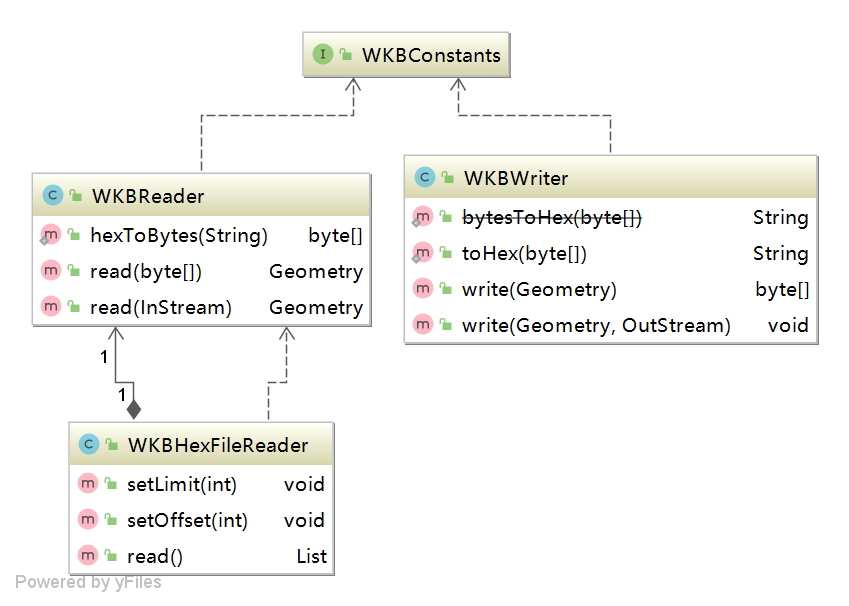

## org.locationtech.jts.io.wkb 使用说明
用于几何值的著名二进制（WKB）表示是由OpenGIS规范定义的。它还定义在ISO “SQL/MM Part 3: Spatial”标准中。<br>
[OGC标准Simple Feature Access - Part 1: Common Architecture](https://www.ogc.org/standards/sfa)<br>
WKB用于以二进制流的形式交换几何数据，二进制流由含几何WKB信息的BLOB值表示。<br>
WKB使用1字节无符号整数、4字节无符号整数、以及8字节双精度数（IEEE 754格式）。1字节等于8比特。<br>
例如，与POINT(1 1)对应的WKB值由下述21字节序列构成（在此，每个字节由2个十六进制数值表示）：<br>
```
0101000000000000000000F03F000000000000F03F
```
该序列可分为下述部分：<br>
```
Byte order : 01
```
```
WKB type   : 01000000
```
```
X          : 000000000000F03F
```
```
Y          : 000000000000F03F
```
表示如下：<br>
· 字节顺序（Byte order）可以是0或1，分别表明little-endian或big-endian存储。little-endian和big-endian字节顺序也分别称为网络数据表示（NDR）和外部数据表示（XDR）。<br>
· “WKB type”（WKB类型）是指明几何类型的代码。取值从1到7，分别表示Point、LineString、Polygon、MultiPoint、MultiLineString、MultiPolygon、和GeometryCollection。<br>
· Point值具有X和Y坐标，每个值均用双精度值表示。<br>
对于更复杂几何值的WKB值，它们是由更复杂的数据结构表示的，详情请参见OpenGIS规范。<br>
###  WKB 相关操作使用说明
#### 说明
涉及WKBWriter、WKBReader、WKBHexFileReader、WKBConstants四个类
#### 操作示例
<br>
```java
package com.leokok.jts.learning.jts.core.io;

import org.locationtech.jts.geom.Geometry;
import org.locationtech.jts.io.ParseException;
import org.locationtech.jts.io.WKBReader;
import org.locationtech.jts.io.WKBWriter;
import org.locationtech.jts.io.WKTReader;

public class WKBTest {

    public static void main(String[] args) throws ParseException {

        WKTReader wktReader = new WKTReader();
        Geometry pointGeo = wktReader.read("POINT(6 10 2)");

        WKBWriter wkbWriter = new WKBWriter();
        byte[] wkb = wkbWriter.write(pointGeo);

        WKBReader wkbReader = new WKBReader();
        Geometry geometry = wkbReader.read(wkb);
        System.out.println(geometry.toText());


    }
}

```

