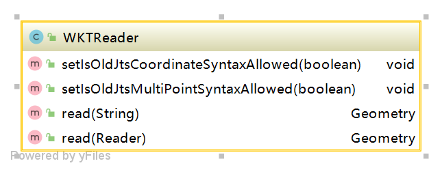
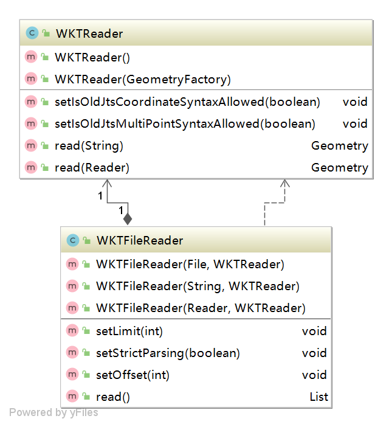
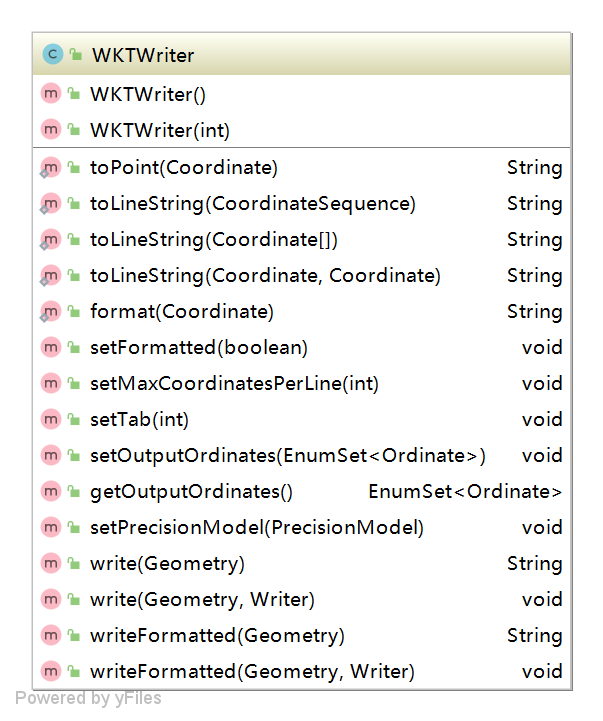

## org.locationtech.jts.io.wkt 使用说明
对WKT格式的数据的输入输出操作，WKT(Well-known text)是一种文本标记语言，用于表示矢量几何对象、空间参照系统及空间参照系统之间的转换。<br/>
WKT可以表示的几何对象包括：点，线，多边形，TIN（不规则三角网）及多面体。可以通过几何集合的方式来表示不同维度的几何对象。<br/>
几何物体的坐标可以是2D(x,y),3D(x,y,z),4D(x,y,z,m),加上一个属于线性参照系统的m值。<br/><br/>
以下为几何WKT字串样例：<br/>
POINT(6 10) //点<br/>
LINESTRING(3 4,10 50,20 25)//线<br/>
POLYGON((1 1,5 1,5 5,1 5,1 1),(2 2,2 3,3 3,3 2,2 2)) //面<br/>
MULTIPOINT(3.5 5.6, 4.8 10.5)//多点<br/>
MULTILINESTRING((3 4,10 50,20 25),(-5 -8,-10 -8,-15 -4))//多线<br/>
MULTIPOLYGON(((1 1,5 1,5 5,1 5,1 1),(2 2,2 3,3 3,3 2,2 2)),((6 3,9 2,9 4,6 3)))//多面<br/>
GEOMETRYCOLLECTION(POINT(4 6),LINESTRING(4 6,7 10))//复杂几何<br/>
POINT EMPTY<br/>
MULTIPOLYGON EMPTY<br/>
[OGC标准Simple Feature Access - Part 1: Common Architecture](https://www.ogc.org/standards/sfa)<br>
###  WKT 相关操作使用说明
#### 说明
涉及WKTConstants、WKTFileReader、WKTReader、WKTWriter四个类
#### 操作示例

WKTReader提供了read方法。<br/>
<br>
WKTFileReader提供了对文件的读取，依赖WKTReader。<br/>
<br>
WKTWriter将Geometry输出WKT格式<br>
<br>
```java
package com.leokok.jts.learning.jts.core.io;

import org.locationtech.jts.geom.Geometry;
import org.locationtech.jts.io.ParseException;
import org.locationtech.jts.io.WKTFileReader;
import org.locationtech.jts.io.WKTReader;
import org.locationtech.jts.io.WKTWriter;

import java.io.File;
import java.io.IOException;
import java.util.List;

/**
 * WKT数据格式操作使用说明
 */
public class WKTTest {

    public static void main(String[] args) throws IOException, ParseException {
        //根据wkt string串读取
        WKTReader wktReader = new WKTReader();
        Geometry pointWkt = wktReader.read("POINT(6 10 2)");
        System.out.println(pointWkt);

        //根据文件读取WKT
        WKTFileReader wktFileReader = new WKTFileReader(new File(WKTTest.class.getResource("/").getPath()+"/wkt/wkt.wkt"), wktReader);
        List<Geometry> geometryList = wktFileReader.read();

        for(Geometry geometry : geometryList){
            System.out.println(geometry);
        }

        //输出
        WKTWriter wktWriter = new WKTWriter(3); //如果不输入3在输出的时候会忽略Z输出
        System.out.println(wktWriter.write(geometryList.get(0)));
        System.out.println(wktWriter.writeFormatted(geometryList.get(0))); //最后加 \n 换行符

    }
}
```

