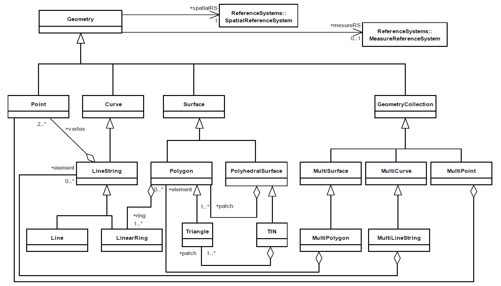

## jts-core 使用说明

### 层次结构

org.locationtech.jts:

- `algorithm` - 算法包
- `jts-io-common` - I/O classes for open spatial formats
- `geom` - geom基础包
- `geom.prep` - 对适当准备的几何图形执行优化的几何操作类
- `edgegraph` - 边与图
- `index` - 空间索引
- `IO` - 各类外部格式输入输出工具包,GML、KML、WKB、WKT等

### 各包使用说明

#### 1.org.locationtech.jts.geom 基础包
geom几何建模参考OGC SFS标准进行java模型建立; 
SFS 中定义的几何对象模型：图中显示的是SFS中几何对象的关系结构，简单要素中的几何对象主要就是定义了点、线、面和多点、多线、多面 
 
另外，几何对象还涉及一系列的操作: 

##### 1.1 说明
1.1.1 提供几何接口与几何操作相关类 
[Coordinate使用说明](geom/coordinate.md) 
[CoordinateArrays使用说明](geom/coordinate_arrays.md) 
[Geometry与其子类等使用说明](geom/geometry.md) 
[Envelope使用说明](geom/envelope.md) 
[IntersectionMatrix说明](geom/DE-9IM.md) 
[PrecisionModel精度说明](geom/precisionmodel.md) 
[PreparedGeometry使用说明](geom/prepare-geometry.md) 
1.1.2 操作工厂类 
[GeometryFactory使用说明](geom/geometry_factory.md) 
[Coordinate工厂使用说明](geom/coordinate-array-sequence-impl.md) 

#### 2.org.locationtech.jts.geom.util 几何相关工具包
[AffineTransformation仿射变换理论基础](geom/affineTransformation_desc.md) 
[AffineTransformation仿射说明](geom/affinetransformation.md) 

#### 3.org.locationtech.jts.edgegraph 边与图
[EdgeGraph使用说明](edgegraph/edgegraph.md) 

#### 4.org.locationtech.jts.index 空间索引算法
[SpatialIndex使用说明](index/index.md) 

#### 5.org.locationtech.jts.io 格式输入输出工具包
[WKT格式输入输出使用说明](io/wkt.md) 
[WKB格式输入输出使用说明](io/wkb.md) 
#### 5.org.locationtech.jts.algorithm 算法包
[Angle角度计算](algorithm/angle.md) 